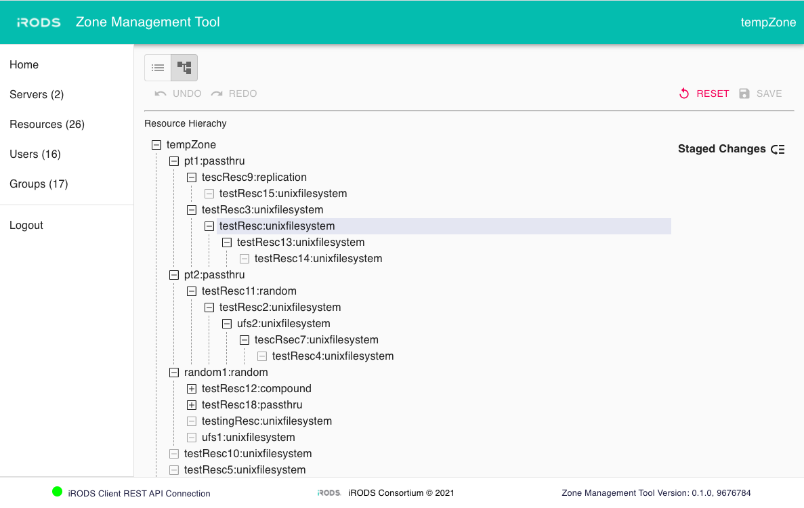

# iRODS Zone Management Tool (ZMT)

A web application for managing an iRODS Zone.



## Setup

### 1. Install Docker and Docker Compose
Follow instructions in Docker docs to install Docker and Docker Compose for your OS.

### 2. Clone the repository from GitHub
```
git clone https://github.com/irods/irods_client_zone_management_tool
```

### 3. Deploy the iRODS Client HTTP Mid-Tier API
Please refer to [iRODS Client HTTP API](https://github.com/irods/irods_client_http_api). You will need the hostname, port, and version of this service.

The C++ HTTP API must be version 0.3.0 or later.

### 4. Setup Environment Variables
Create a file named '.env' and place under the root directory. Please refer to sample.env file, setup the following environment variables and save the file.

```
#######################################
# Location of the iRODS Client HTTP API
# <protocol>://<host>:<port>/irods-http-api/<http_api_version>
#
# e.g. https://example.org:8080/irods-http-api/0.4.0

REACT_APP_HTTP_API_URL=

#######################################
# Defaults

LISTEN_PORT=9000
REACT_APP_APPBAR_LOGO=iRODS-logo.jpg
REACT_APP_LOGIN_LOGO=iRODS-logo-1.png
REACT_APP_BRANDING_NAME=Zone Management Tool
REACT_APP_PRIMARY_COLOR=#04bdaf
```

### 5. Deploy the ZMT via Docker Compose

#### Start Service
Use the following code to start service.
```
docker compose up
```

#### Stop Service
```
docker compose down
```

## Health checks in ZMT
ZMT will load its health checks from two checkfile directories (default and custom).  Default checks are included and on by default.

Results of each check are presented as 'healthy', 'warning', 'error', 'invalid', 'inactive', or 'unavailable'.

### localStorage

- `active` - Each health check's status.  Can be set to 'false' to no longer run.

- `interval` - Each health check's interval between reaching out to the server, in seconds.

ZMT will hold each checkfile's settings in localStorage until Logout.

### Custom health checks
Additional health checks can be added to your ZMT deployment.

On startup, ZMT will validate each checkfile and provide any errors in the table view (with additional information in the browser console).

#### 1. Create a new checkfile
Copy `src/data/checkfiles/checkfile_template.js` into the `src/data/checkfiles/custom_checkfiles` directory.  The name of the new checkfile does not matter.

#### 2. Fill in the required values

Required:
- `name` - non-empty string
- `description` - non-empty string
- `interval_in_seconds` - positive integer
- `active` - true or false
- `checker` - javascript object which returns a `result` object

Optional:
- `minimum_server_version` - string representing `major.minor.patch` level of the iRODS server
- `maximum_server_version` - string representing `major.minor.patch` level of the iRODS server

#### 3. Restart ZMT
ZMT will re-validate and re-run each defined checkfile.

## Built With
  - [React](https://reactjs.org/) - Reactive frontend framework built by Facebook
  - [Material UI](https://material-ui.com/) - Material Design
