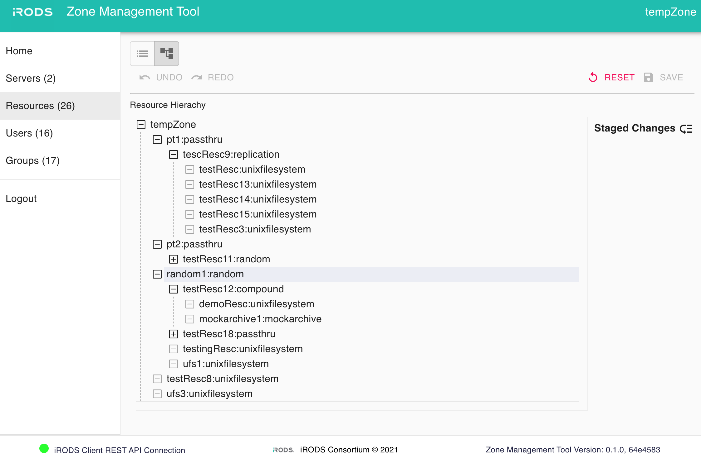

# iRODS Zone Management Tool (ZMT)

A web application for managing an iRODS Zone.



## Setup

### 1. Install Docker and Docker Compose
Follow instructions in Docker docs to install Docker and Docker Compose for your OS.

### 2. Clone the repository from GitHub
```
git clone https://github.com/irods/irods_client_zone_management_tool
```

### 3. Deploy the iRODS Client REST Mid-Tier API 
Please refer to [iRODS Client REST API](https://github.com/irods/irods_client_rest_cpp) and build this repository. You will need the hostname and port of this service.

### 4. Setup Environment Variables
Create a file named '.env' and place under the root directory. Please refer to sample.env file, setup the following environment variables and save the file.

```
#######################################
# Location of the iRODS Client REST API
# <protocol>://<host>:<port>/irods-rest/<rest_api_version>
#
# e.g. https://example.org:8080/irods-rest/0.9.1

REACT_APP_REST_API_URL=

#######################################
# Defaults

LISTEN_PORT=9000
REACT_APP_APPBAR_LOGO=iRODS-logo.jpg
REACT_APP_LOGIN_LOGO=iRODS-logo-1.png
REACT_APP_BRANDING_NAME=Zone Management Tool
REACT_APP_PRIMARY_COLOR=#04bdaf
```

### 5. Deploy the ZMT via Docker Compose

#### Start Service
Use the following code to start service.
```
docker-compose up
```

#### Stop Service
```
docker-compose down
```

## Health checks in ZMT
ZMT will load all health checks from checkfile directory. Each checkfile represents a health check. Default checks are provided to you and those include checks for REST endpoints, resources, and more. To turn off a health check, set the active property to false in each checkfile or uncheck its checkbox in the table view. Results of each check are presented as status in ZMT, it could be 'healthy', 'warning', 'error', or 'inactive', along with detailed messages if you click on each table row.

ZMT will hold your setting for each checkfile (interval, active) in localStorage unless you log out.

### Create your custom health checks
You can make your custom health check in ZMT. Name, description, interval and checker function are required for each checkfile. You can also specify the min/max irods server version if needed. ZMT will validate each checkfile before running it, if you happen to provide an invalid checkfile, you will see an error status in the table view and a detailed error message in your console.

#### 1. Make a new checkfile
Create a javascript file (i.e. abcd.js) and place it under /src/data/checkfiles/custom_checkfiles directory. Please refer to the checkfile_template.js file.

#### 2. Create name, description, interval, checker function for the new health check
In your newly created javascript object, add value for name, description, interval_in_seconds and checker property. Make sure the value of name, description property is non-empty string, and the value of interval_in_seconds is positive value. Specify minimum_server_version and maximum_server_version if needed. If ZMT encounters issues when running your check, you will see an error message in both the table view and console.

#### 3. Refresh ZMT
A refresh will let ZMT reload health checks and run all checks again.

## Built With
  - [React](https://reactjs.org/) - Reactive frontend framework built by Facebook
  - [Material UI](https://material-ui.com/) - Material Design
